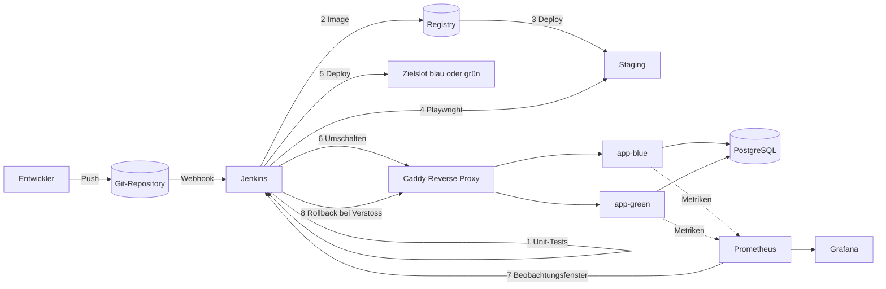

# Architektur

## Überblick

## Warum Blue/Green und nicht einfach neu starten

Der Rückweg muss schneller sein als der Hinweg. Beim Ersetzen eines Containers
dauert ein Rollback so lange wie ein vollständiger Neubau. Bei Blue/Green
läuft die alte Version noch; der Rollback ist eine Umlenkung des Verkehrs und
damit eine Frage von Sekunden.

## Warum Metriken und nicht nur ein Health-Check

Ein Health-Check beantwortet die Frage, ob der Prozess Verkehr annehmen kann.
Er beantwortet nicht, ob die Antworten richtig sind. Der häufigste Fall eines
schlechten Releases ist genau der dazwischen: der Prozess lebt, meldet sich
gesund und liefert trotzdem Fehler aus. Deshalb entscheidet über die Freigabe
die beobachtete Fehlerrate, nicht der Health-Check.

Der Chaos-Schalter nimmt `/healthz` bewusst aus. Sonst würde die Pipeline
bereits vor dem Umschalten abbrechen und der interessante Fall nie eintreten.

## Zustand und Datenhaltung

Die Anwendung ist zustandslos. Beide Slots sprechen dieselbe Datenbank, sonst
wäre ein Umschalten mit Datenverlust verbunden. Seit Story P-01 ist das der
Normalfall: `store.Speicher` hat eine PostgreSQL-Implementierung auf Basis von
pgx, und in `prod` erzwingt die Konfiguration die Datenbank-URL. Der
In-Memory-Speicher bleibt als Rückfallweg für den lokalen Start ohne Docker.

Der Aufrufzähler wird dabei in der Datenbank erhöht und nicht im Prozess. Sonst
hinge die Zahl davon ab, welcher Slot die Weiterleitung bedient hat, und wäre
nach jedem Umschalten eine andere.

`/healthz` fragt über `Pruefen` die Datenbank wirklich an. Ein Slot ohne
Datenbank meldet damit 503, Caddy nimmt ihn aus dem Verkehr, und die Pipeline
schaltet gar nicht erst um.

## Offene Punkte

- TODO(C-05): eigene Registry, Push aktivieren
- TODO(O-06): Alertmanager mit echter Benachrichtigung
